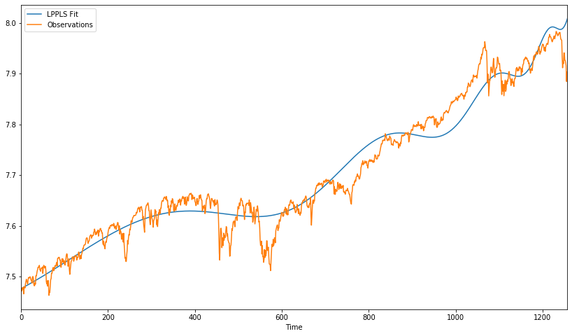

# Log Periodic Power Law Singularity (LPPLS) Model 
`lppls` is a Python module for fitting the LPPLS model to data.


## Overview
The LPPLS model provides a flexible framework to detect bubbles and predict regime changes of a financial asset. A bubble is defined as a faster-than-exponential increase in asset price, that reflects positive feedback loop of higher return anticipations competing with negative feedback spirals of crash expectations. It models a bubble price as a power law with a finite-time singularity decorated by oscillations with a frequency increasing with time. 

Here is the model:


  where:

  -  expected log price at the date of the termination of the bubble
  -  critical time (date of termination of the bubble and transition in a new regime) 
  -  expected log price at the peak when the end of the bubble is reached at 
  -  amplitude of the power law acceleration
  -  amplitude of the log-periodic oscillations
  -  degree of the super exponential growth
  -  scaling ratio of the temporal hierarchy of oscillations
  -  time scale of the oscillations
    
The model has three components representing a bubble. The first, , handles the hyperbolic power law. For  when the price growth becomes unsustainable, and at  the growth rate becomes infinite. The second term, , controls the amplitude of the oscillations. It drops to zero at the critical time . The third term, , models the frequency of the osciallations. They become infinite at .

## Important links
 - Official source code repo: https://github.com/Boulder-Investment-Technologies/lppls
 - Download releases: https://pypi.org/project/lppls/
 - Issue tracker: https://github.com/Boulder-Investment-Technologies/lppls/issues

## Installation
Dependencies

`lppls` requires:
 - Pandas (>= 0.25.0)
 - Python (>= 3.6)
 - NumPy (>= 1.17.0)
 - SciPy (>= 1.3.0)
 - Matplotlib (>= 3.1.1)

User installation
If you already have a working installation of numpy and scipy, the easiest way to install scikit-learn is using pip
```
pip install -U lppls
```

## Example Use
```python
from datetime import datetime
from lppls import lppls
import numpy as np
import pandas as pd

SECONDS_IN_A_MONTH = 2.628e+6

data = pd.read_csv('data/sp500.csv', index_col='Date')

timestamp = [datetime.timestamp(dt) for dt in data.index]
price = [p for p in data['Adj Close']]
last_ts = timestamp[-1]

observations = np.array([timestamp, price])

# set limits for non-linear params
search_bounds = [
    (last_ts, last_ts + SECONDS_IN_A_MONTH),    # Critical Time 
    (0.1, 0.9),                                 # m : 0.1 ≤ m ≤ 0.9
    (6, 13),                                    # ω : 6 ≤ ω ≤ 13
]

MAX_SEARCHES = 25

lppls_model = lppls.LPPLS(use_ln=True, observations=observations)

tc, m, w, a, b, c1, c2 = lppls_model.fit(observations, MAX_SEARCHES, search_bounds, minimizer='Nelder-Mead')

lppls_model.plot_fit(tc, m, w, observations)

# should give a plot like the following...
```



## References
 - Filimonov, V. and Sornette, D. A Stable and Robust Calibration Scheme of the Log-Periodic Power Law Model. Physica A: Statistical Mechanics and its Applications. 2013
 - Sornette, D. Why Stock Markets Crash: Critical Events in Complex Financial Systems. Princeton University Press. 2002.
